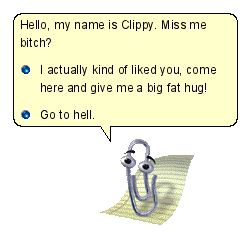

## Installation

```npm
npm install betterdocx
```

Then you can `import` as usual:

```ts
import * as docx from "betterdocx";
// or
import { ... } from "betterdocx";
```

The root entry contains the complete backwards-compatible API. Purpose-specific
subpaths are also available:

| Entry                 | Use for                                                        |
| --------------------- | -------------------------------------------------------------- |
| `betterdocx/core`     | Building and packing documents without template patching code  |
| `betterdocx/patcher`  | Patching templates, detecting placeholders, and reading styles |
| `betterdocx/advanced` | Custom low-level OOXML components and formatter extensions     |

For example, a generation-only application may import `Document`, `Packer`, and its
document components from `betterdocx/core`. Existing root imports remain supported.

## Basic Usage

```ts
import * as fs from "fs";
import { Document, Packer, Paragraph, TextRun } from "betterdocx";

// Documents contain sections, you can have multiple sections per document, go here to learn more about sections
// This simple example will only contain one section
const doc = new Document({
    sections: [
        {
            properties: {},
            children: [
                new Paragraph({
                    children: [
                        new TextRun("Hello World"),
                        new TextRun({
                            text: "Foo Bar",
                            bold: true,
                        }),
                        new TextRun({
                            text: "\tGithub is the best",
                            bold: true,
                        }),
                    ],
                }),
            ],
        },
    ],
});

// Used to export the file into a .docx file
Packer.toUint8Array(doc).then((bytes) => {
    fs.writeFileSync("My Document.docx", bytes);
});

// Done! A file called 'My Document.docx' will be in your file system.
```



## A Fork

This is a fork of the excellent docxjs library by [dolanmiu](https://github.com/dolanmiu)
